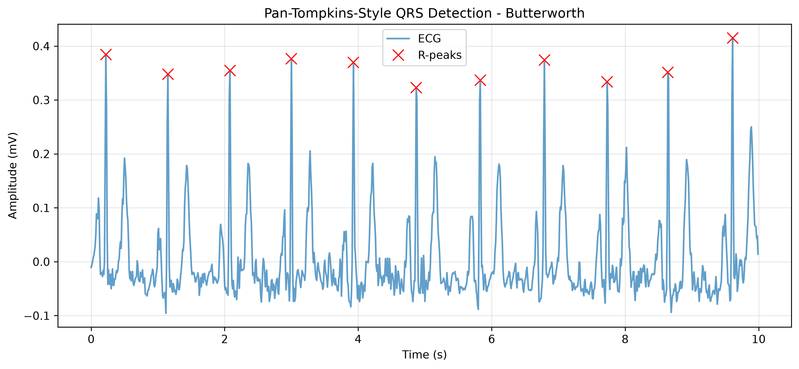
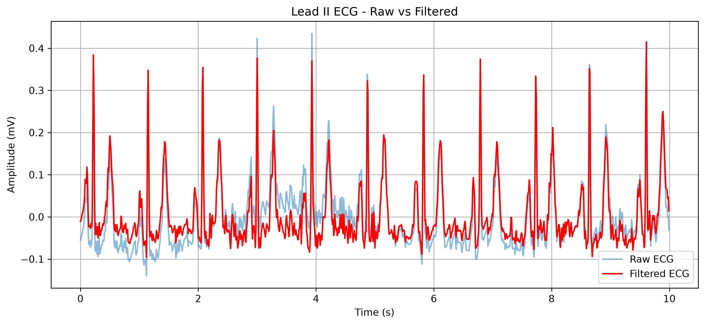
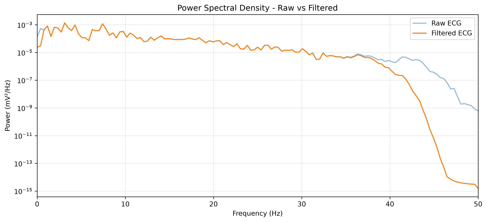

# ECG Signal Processing & Filter Comparison

A Python signal-processing project exploring how Butterworth and Chebyshev preprocessing affect Pan–Tompkins-style R-peak detection in PTB-XL Lead II recordings.

**Portfolio v1:** an offline analysis pipeline with waveform visualization, spectral analysis, RR-interval measurements, and a reproducible four-method comparison across 20 ECG records.



## What this project demonstrates

- Loading multilead WFDB recordings and dataset metadata with Python.
- Designing Butterworth, Chebyshev Type I, and Chebyshev Type II filters using SciPy second-order sections and forward–backward filtering.
- Implementing a simplified Pan–Tompkins-style detector: bandpass → derivative → squaring → moving-window integration → thresholding → peak refinement.
- Comparing time-domain signals, Welch power spectral density, detected heart rate, and RR intervals.
- Running batch experiments and exporting per-record results and aggregate reports.

**Stack:** Python, NumPy, SciPy, pandas, Matplotlib, WFDB, pytest.

## Results

The saved experiment covers the first **20 PTB-XL metadata records at 100 Hz**, with **four methods and 80 successful executions**.

| Preprocessing | Completed runs | Mean detected peaks per record | Mean detected heart rate (BPM) |
|---|---:|---:|---:|
| Raw baseline | 20/20 | 13.00 | 77.51 |
| Butterworth | 20/20 | 13.00 | 77.51 |
| Chebyshev I | 20/20 | 12.95 | 77.50 |
| Chebyshev II | 20/20 | 13.00 | 77.51 |

Methods produce similar aggregate results on this subset. ECG 12 has a different detected peak count across methods; matching counts elsewhere do not establish matching peak timing. These are descriptive measurements, **not accuracy scores**. Successful execution means the pipeline completed without an exception.

Read the [results and limitations](results/SUMMARY.md), [aggregate CSV](results/filter_summary.csv), or [per-record results](results/ptbxl_filter_comparison_4methods.csv).





## Run locally

Use Python 3.13 (the locally tested interpreter). From the repository root:

```bash
python3 -m venv .venv
source .venv/bin/activate
python -m pip install -r requirements.txt
```

`requirements-lock.txt` records the package versions in the tested local environment. `requirements.txt` lists the direct dependencies for installation.

### Explore the saved experiment without downloading ECG data

```bash
python SRC/summarize_results.py
```

This generates `results/SUMMARY.md` and `results/filter_summary.csv` from the included comparison CSV.

### Reproduce the waveform analysis

I used the PTB-XL 1.0.3 dataset from PhysioNet and downloaded the waveform files from:
https://physionet.org/content/ptb-xl/1.0.3/records500/00000/#files-panel

Obtain PTB-XL 1.0.3 from PhysioNet, observing its dataset license and attribution requirements. Put `ptbxl_database.csv` and the required waveform files in this layout:

```text
physionet.org/files/ptb-xl/1.0.3/
├── ptbxl_database.csv
└── records100/00000/
    ├── 00001_lr.hea
    ├── 00001_lr.dat
    └── ...
```

The demo requires the first metadata record. The default batch requires waveform/header pairs for the first 20 records. Downloaded datasets are excluded from new Git additions by `.gitignore`.

```bash
python SRC/main.py
python SRC/batch_validation.py --num-records 20 --output results/ptbxl_batch_validation.csv
python SRC/summarize_results.py --input results/ptbxl_batch_validation.csv
python -m pytest -q
```

Figures go to `results/figures/`. The automated integration test requires the first local ECG record. For a manual interactive peak plot, run `python tests/test_qrs_plot.py`.

## Method and scope

The comparison applies optional external preprocessing before an identical detector. The raw baseline skips external preprocessing but **still uses the detector's internal 5–15 Hz bandpass**. External filter designs use order 4 and frequency parameters of 0.5 and 40 Hz; Chebyshev I uses 0.5 dB ripple and Chebyshev II uses 40 dB stopband attenuation. These are fixed-parameter designs, not filters matched to identical frequency-response specifications.

The detector uses a five-point derivative, squaring, a 150 ms integration window, a threshold of 15% of the maximum integrated signal, a 200 ms candidate spacing, and local positive-peak refinement. Heart rate is calculated as 60 divided by mean detected RR interval. At 100 Hz, samples are 10 ms apart. The 50 Hz notch is skipped in the current pipeline.

This is an exploratory signal-processing project, not a diagnostic tool. The experiment has no beat-level reference labels and does not establish sensitivity, precision, F1, or clinical accuracy. Fixed thresholds and positive-peak refinement can miss difficult or inverted complexes. Zero-phase processing is offline; this is not a real-time implementation. The first 20 records are a convenience sample.

## Repository guide

| File | Purpose |
|---|---|
| `SRC/main.py` | Single-record demonstration and plots |
| `SRC/data_loader.py` | Metadata and WFDB loading; lead selection |
| `SRC/preprocessing.py` | Filter designs and preprocessing selection |
| `SRC/qrs_detection.py` | Simplified R-peak detector |
| `SRC/analysis.py` | Welch spectral analysis |
| `SRC/batch_validation.py` | Batch comparison with configurable record count |
| `SRC/summarize_results.py` | Summary generation from saved results |
| `tests/` | Integration test and manual plotting script |
| `docs/PORTFOLIO.md` | Project description and résumé bullets |

### Project layout

```text
ECG/
├── README.md                 # Public project overview
├── requirements.txt          # Installation dependencies
├── requirements-lock.txt     # Tested environment versions
├── SRC/                      # Analysis pipeline
├── tests/                    # Integration test and manual visualization
├── docs/PORTFOLIO.md          # Portfolio description and résumé bullets
├── results/
│   ├── SUMMARY.md            # Experiment findings and limitations
│   ├── filter_summary.csv    # Aggregate results
│   ├── figures/              # Current demo figures
│   ├── archive/              # Earlier figures retained for reference
│   └── visual_validation/    # Record-level inspection figures
└── notes/                    # Personal learning notes; Git-ignored locally
```

The local `notes/LEARNING_SUMMARY.md` brings together the learning covered in this project. Personal notes are kept outside the public portfolio files. `SRC/old.py` remains as a historical script; use `SRC/main.py` for the current workflow.

## Future work

- Evaluate a larger, reproducibly selected subset, including noisy signals.
- Add beat-level reference annotations and peak-matching accuracy metrics.
- Improve adaptive thresholding and handling of inverted QRS complexes.
- Compare wavelet denoising, matched filter specifications, and runtime.
- Expand synthetic edge-case tests and configurable data paths.

## Attribution

Dataset: **PTB-XL, a large publicly available electrocardiography dataset**, version 1.0.3, PhysioNet. See the dataset's included documentation for its authors, citation, and license. The detector is inspired by Pan and Tompkins' *A Real-Time QRS Detection Algorithm* (1985); this project implements a simplified offline variant.
